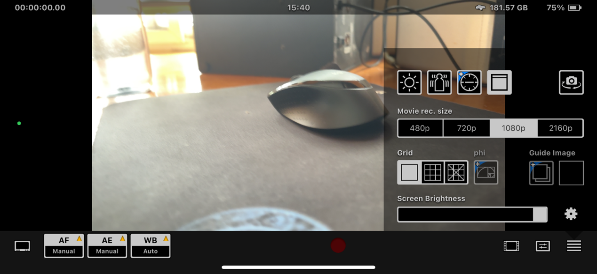

# HEx(cam)使用教程

本章将会讲述关于苹果软件HEx(cam)的基本操作方式。

请在苹果AppStore中搜索并下载

打开软件，允许软件要求的网络麦克风摄像头权限。

接下来让我们来看一下软件的基本参数

HEx(cam)中的AF界面
  

AF用于对焦，一般不需要调整，在屏幕中点击拍摄的对象自动对焦即可。

HEx(cam)中的AE界面
  

AE调整参数，一般在Manual中将快门速度（Shutter Speed）改为1/25，ISO根据拍摄的环境改为1600以上即可获得比较好的拍摄效果，但在拍摄前可以多尝试一下别的iso数值。

HEx(cam)中的WB界面
  

WB色温等调节，一般可以不考虑。

HEx(cam)中的右侧界面
  

右侧选项，太阳图标为打开闪光灯，一般不需要，第二个不知道是什么，第三个要钱，第四个开关上方状态栏，相机按键为翻转摄像头，下方改变拍摄分辨率，一般为1080p，Grid为开关画面网格，可用于校准是否水平，其他应该并用不上。

HEx(cam)界面
  

点击屏幕下方的红点即为开始录制。

（注：需要手机剩余储存空间大于1G才能开始录制）

HEx(cam)界面
  

录制完的视频可以在下方右数第三个按键中找到。

HEx(cam)中的视频界面

打开后即为上图界面。

HEx(cam)中的视频界面

若要导出视频点击右上方导出键，同意访问相机后选择你的视频。

HEx(cam)中的视频界面

点击右上角的Export，点击Export CameraRoll即可导出至手机相册。