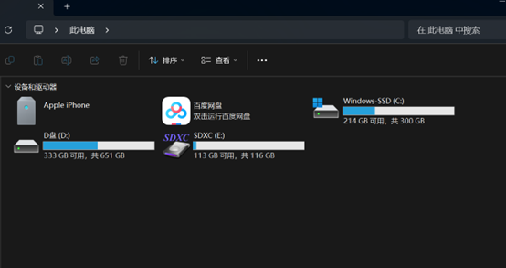
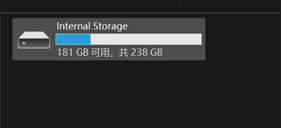

# 苹果篇

本篇将会讲述苹果系统的手机如何将刚才录制好的视频导入进电脑以便于剪辑等操作。

由于编写者设备限制，本篇所有的电脑操作系统都将以Windows11系统为例。

如果有想要投稿其他系统教程的请联系我。

## 有线

1. 将你的手机用数据线连接到电脑上

2. 打开自己的文件资源管理器，找到并打开“此电脑”。

此电脑

3. 在此电脑中你应该可以找到类似上图的一堆文件夹。

4. 选中“Apple iPhone”并双击进入。

Apple iPhone中的内容

5. 继续打开。

Internal Storage中的内容

6. 找到自己拍摄视频的时间，一般是以年+月来命名的文件夹。

拍摄时间中的内容

7. 找到拍摄的视频，并将其拖入电脑中想要放的文件夹。

## 无线

本篇将会推荐一款用于无线传输的软件，并讲述该软件以及QQ，微信传输视频文件的方法。

