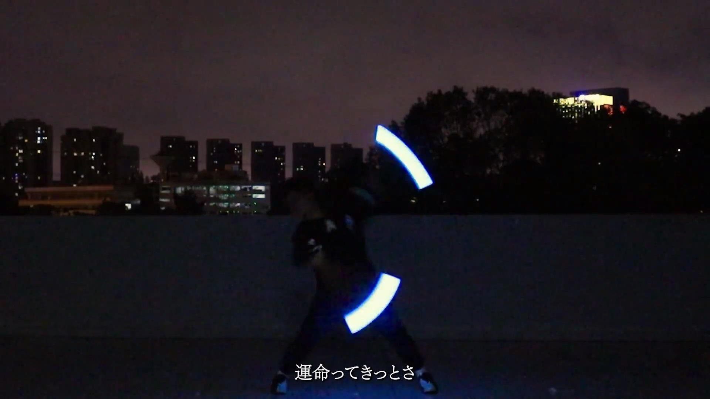

# 认识光弧

首先，让我们认识光弧是什么。

但在介绍光弧之前，让我先来介绍**视觉暂留现象**

##### 视觉暂留现象

人眼在观察景物时，光信号传入大脑神经，需经过一段短暂的时间，光的作用结束后，视觉形象并不立即消失，这种残留的视觉称 “后像”，视觉暂留现象是残影产生的根本原因。

当物体在快速运动时，当人眼所看到的影像消失后，人眼仍能继续保留其影像 0.1 - 0.4 秒左右的图像。电影技术就是利用了这个原理，通过每秒播放一定帧数（一般是 24 帧）的静态画面，让观众感觉画面是连续运动的。

在暗处，环境光比较弱。人眼的瞳孔会放大，没有明亮的背景光线来干扰，所以残影就更容易被人察觉到。

##### 光弧

了结了上面提到的视觉暂留现象，也就能够理解光弧是如何产生的了。

打师挥动的光棒在人眼或摄像机中得到的画面由于视觉暂留现象会形成一道光弧。

如下图。

【WOTA艺】女神——目不转睛，希望憧憬不会消失【高考应援】

以图中帕拉德为例。

【WOTA艺】女神——目不转睛，希望憧憬不会消失【高考应援】

我们可以看到，在这一帧中帕拉德手中的光棒形成了一段光弧，光棒放出的光线照亮了他的身体以及地面，并以此凸显出人物的形体。

